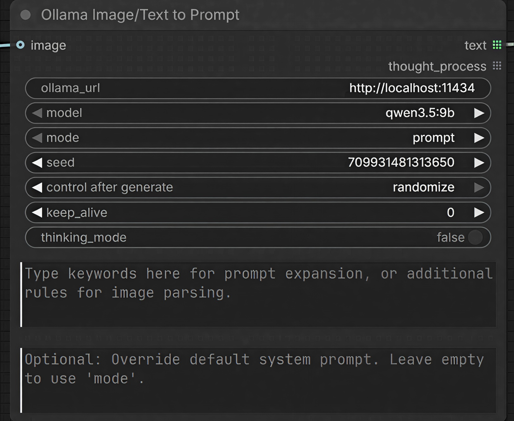

<div align="center">
  <h1>ComfyUI Ollama Image & Text to Prompt</h1>
  <p><strong>A ComfyUI custom node that integrates local Ollama models for both Vision-Language (VLM) image analysis and text-based prompt expansion operations.</strong></p>

  [](https://www.python.org/downloads/)
  [](https://github.com/astral-sh/ruff)
  [](https://opensource.org/licenses/MIT)
  [](https://github.com/jluo-github/comfyui-ollama-image-to-prompt/actions)
</div>

---

## Overview

The **Ollama Image/Text to Prompt** node enables local Vision-Language Models (VLMs) and LLMs to run within ComfyUI workflows. It operates as a dual-purpose node:

- **Vision Mode:** Processes input images to produce natural language descriptions, Danbooru tags, or video motion instructions.
- **Text Mode:** Processes input text keywords without an image to expand them into detailed prompts and tags.

The node includes 9 distinct architectural presets for processing inputs.



## Setup

1. Install [Ollama](https://ollama.com/) locally and pull a required model (e.g., `qwen3.5:9b`).
2. Clone the repository into your ComfyUI custom nodes directory:
   ```bash
   cd ComfyUI/custom_nodes/
   git clone https://github.com/jluo-github/comfyui-ollama-image-to-prompt.git
   cd comfyui-ollama-image-to-prompt
   pip install -r requirements.txt
   ```
3. Restart ComfyUI.

## Usage

The node can be configured for either image-based or text-based processing:
- **Vision Setup (Image to Prompt):** Provide an input to the `image` interface and select a processing mode (e.g., `prompt`).
- **Text Setup (Text to Prompt):** Leave the `image` interface disconnected, define input text via the `keywords` parameter, and select an expansion mode (e.g., `expand_prompt`).

### Processing Modes

| Mode | Function |
| :--- | :--- |
| `prompt` | Extracts dense, highly-descriptive prose for models such as Flux or Qwen. |
| `danbooru_tags` | Extracts comma-separated Booru-style tags, formatted for models like NoobAI or Illustrious. |
| `anima` | Produces a unified tag and natural language output tailored for the Anima diffusion model. |
| `expand_prompt` | Expands concise user keywords into rich, full-sentence prompts. |
| `expand_tags` | Expands concise user keywords into dense Danbooru tag formats. |
| `expand_anima` | Translates simple character names and keywords into deeply structured, 4-layer prompts specialized for the Anima model. |
| `image_edit` | Generates structured editing instructions for image-to-image models. |
| `video_prompt` | Generates physics-based, cinematic instructions for video generation models. |
| `video_storyboard` | Generates shot-by-shot directorial sequences. |
| `json_extract` | Extracts high-detail structured output configured as JSON. |

### Configuration Parameters

| Parameter | Default | Description |
| :--- | :--- | :--- |
| `ollama_url` | `http://localhost:11434` | The endpoint URL for the local Ollama service. |
| `model` | `qwen3.5:9b` | The local vision or language model to execute. |
| `mode` | `prompt` | The architectural preset to use for processing. |
| `seed` | `0` | Defines the randomization seed for generation determinism. |
| `keep_alive` | `0` | Model VRAM cache duration in minutes (`-1` for indefinite caching). |
| `thinking_mode` | `False` | Enables reasoning logs for supported models (e.g., DeepSeek-R1). Disabling this bypasses the `<think>` generation phase. |
| `keywords` | `(Empty)` | Provides base keywords for Text Mode expansion, or appends instructions/rules during Vision Mode processing. |
| `custom_prompt` | `(Empty)` | Overrides the preset system prompt format. |

### Outputs

- `text` *(STRING)*: The generated prompt or formatted tag output.
- `thought_process` *(STRING)*: The captured latent reasoning trace if `thinking_mode` is enabled for compatible models.

---

<div align="center">
    Distributed under the MIT License.
</div>